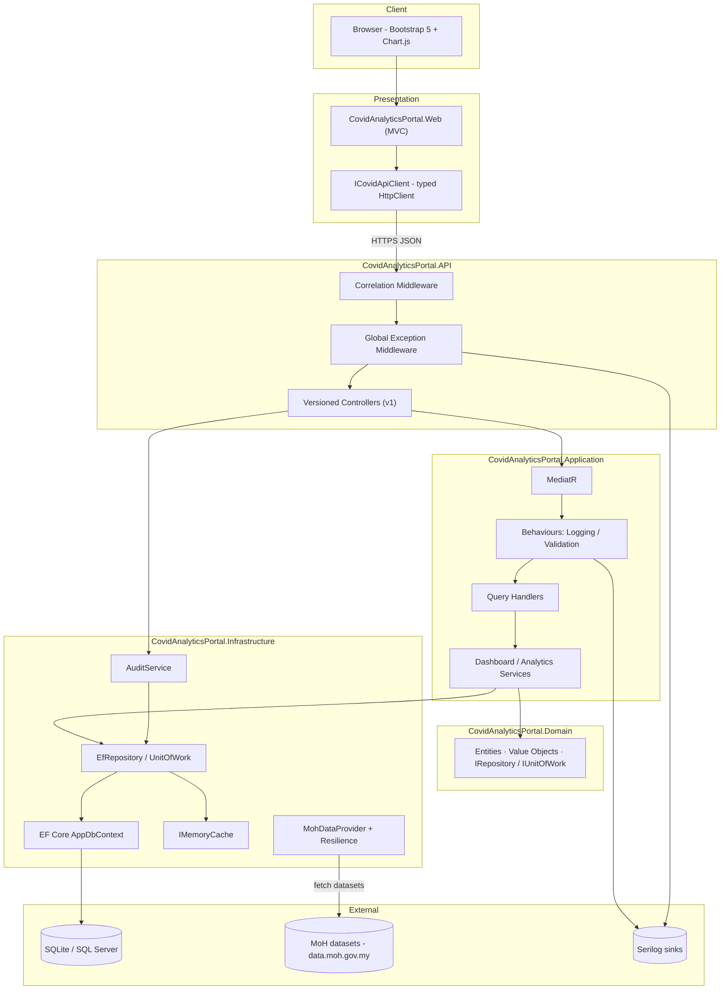
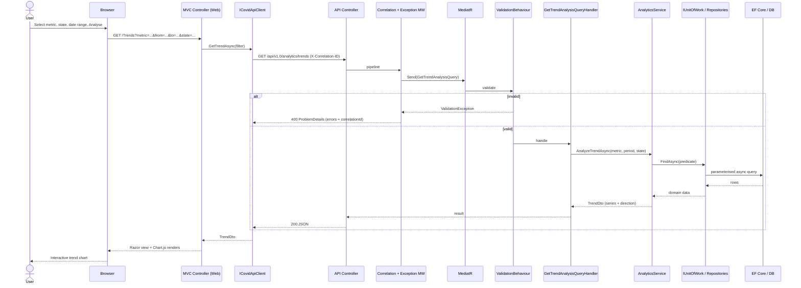

# COVID-19 Analytics Portal

> Enterprise-grade analytics portal for Malaysian COVID-19 data, built on **.NET 8** with **Clean Architecture**, **CQRS**, and a server-rendered **ASP.NET Core MVC** front-end that consumes an internal **REST API**.
>
> **Data source:** [Ministry of Health Malaysia — `data.moh.gov.my`](https://data.moh.gov.my/) (KKMNOW) and the open datasets at [`github.com/MoH-Malaysia/covid19-public`](https://github.com/MoH-Malaysia/covid19-public).

[](https://dotnet.microsoft.com/)
[](#architecture)
[](#running-tests)
[](#running-tests)

---

## Table of Contents

1. [Project Overview](#project-overview)
2. [Architecture](#architecture)
3. [Design Decisions](#design-decisions)
4. [Setup Instructions](#setup-instructions)
5. [Running Tests](#running-tests)
6. [Security Considerations](#security-considerations)
7. [CI/CD Suggestions](#cicd-suggestions)
8. [Diagrams](#diagrams)
9. [ADR Summary](#adr-summary)
10. [Project Structure](#project-structure)
11. [Roadmap](#roadmap)

---

## Project Overview

The COVID-19 Analytics Portal ingests Malaysia's public health datasets into a local, read-optimised store and surfaces three analytical experiences:

| Page | Purpose |
|------|---------|
| **Dashboard** | National headline figures (total/active/recovered/deaths) with a per-state breakdown and bar chart. |
| **Trend Analysis** | Time-series of a chosen metric (cases, active, recovered, deaths), national or per-state, with change/direction summary and a line chart. |
| **State Statistics** | Filterable, tabular per-state daily figures over a date range. |

### Why a local persistence layer?

The upstream MoH Open API is rate-limited and the static datasets are daily snapshots. The portal **ingests and normalises** that data locally so it can:

- Serve fast, filterable analytics without hammering the upstream feed.
- Compute trends and aggregations server-side.
- Stay available when the upstream feed is briefly unreachable (resilience).
- Maintain an **immutable audit trail** of data access and ingestion runs.

### Technology Stack

| Concern | Technology |
|---------|-----------|
| Runtime | .NET 8 (LTS) |
| Web / API | ASP.NET Core MVC, ASP.NET Core Web API, `Asp.Versioning` |
| Mediation / CQRS | MediatR 12 (queries, commands, pipeline behaviours) |
| Validation | FluentValidation 11 (runs inside the MediatR pipeline) |
| Persistence | EF Core 8 (SQLite for dev, SQL Server for prod) |
| Resilience | `Microsoft.Extensions.Http.Resilience` (retry, timeout, circuit breaker) |
| Caching | `IMemoryCache` |
| Logging | Serilog (console + rolling file, correlation enrichment) |
| API docs | Swashbuckle / Swagger (versioned) |
| UI | Razor Views, Bootstrap 5, Chart.js |
| Testing | xUnit, FluentAssertions, Moq, `WebApplicationFactory`, Coverlet |

---

## Architecture

The solution follows **Clean Architecture** (Onion / Hexagonal): the domain sits at the centre with **zero outward dependencies**; frameworks, the database, and the MoH feed are *plug-in details* on the outer ring. The **dependency rule** points strictly inward and is enforced by project references.

```
┌──────────────────────────────────────────────────────────┐
│  Presentation                                            │
│  CovidAnalyticsPortal.Web (MVC)  ─HTTP→  .API (REST)     │
├──────────────────────────────────────────────────────────┤
│  Infrastructure                                          │
│  EF Core · MoH HttpClient · IMemoryCache · Serilog · Audit│
├──────────────────────────────────────────────────────────┤
│  Application                                             │
│  CQRS handlers · DTOs · Validators · Service interfaces  │
├──────────────────────────────────────────────────────────┤
│  Domain (core)                                          │
│  Entities · Value Objects · Enums · IRepository / IUoW   │
└──────────────────────────────────────────────────────────┘
```

### Dependency flow

```
Web  ──HTTP──▶  API ──▶ Application ──▶ Domain
                         ▲                 ▲
        Infrastructure ──┘─────────────────┘
        (implements Application & Domain interfaces)
```

- **Domain** references nothing. It owns the entities (`CovidStatistic`, `StateStatistic`, `TrendRecord`, `AuditTrail`), value objects (`DateRange`, `StateCode`, `CaseMetrics`), and the **repository / unit-of-work abstractions**.
- **Application** references Domain only. It hosts CQRS queries/handlers, DTOs, FluentValidation validators, MediatR pipeline behaviours (logging, validation), and service contracts.
- **Infrastructure** references Application (and transitively Domain). It implements persistence (EF Core repositories, unit of work), the resilient MoH HTTP integration, caching, the audit service, and Serilog configuration.
- **API** references Application + Infrastructure. It exposes versioned REST controllers, global exception handling, correlation middleware, and Swagger.
- **Web** references **none of the above** — it consumes the API purely over HTTP via a typed `HttpClient`, preserving the architectural seam and proving the "REST API consumed by MVC" pattern.

### Layer responsibilities

| Layer | Owns | Must not |
|-------|------|----------|
| Domain | Business rules, invariants, value objects, interfaces | Reference EF Core, ASP.NET, or any framework |
| Application | Use-cases (CQRS), validation, mapping to DTOs | Touch the database or HTTP directly |
| Infrastructure | EF Core, HttpClient, cache, logging sinks | Contain business rules |
| API | HTTP surface, versioning, error translation | Contain business logic |
| Web | Views, view models, API consumption | Reference Domain/Application/Infrastructure directly |

---

## Design Decisions

A condensed rationale (full records in the [ADR Summary](#adr-summary)).

- **Split Web + API hosts.** The MVC app calls a separate REST API over HTTPS using a typed `ICovidApiClient`. This satisfies the explicit "REST consumed by MVC" requirement and leaves a clean contract for a future SPA/mobile client.
- **Repository + Unit of Work abstractions live in the *Domain*.** The domain declares `IRepository<T>` and `IUnitOfWork`; Infrastructure provides the EF Core implementations. This keeps the persistence contract a first-class domain concept and the dependency rule intact.
- **Selective CQRS via MediatR.** Reads dominate (dashboard, statistics, trends). Cross-cutting concerns (logging, validation) are centralised as pipeline behaviours rather than scattered through handlers. No event sourcing or separate read/write databases — that would be over-engineering for this scope.
- **Rich domain value objects.** `StateCode` (validated ISO-3166-2:MY), `DateRange` (end ≥ start invariant), and `CaseMetrics` (non-negative counters) make illegal states unrepresentable, pushing validation into the type system.
- **EF Core as a read cache.** Owned types map the value objects; value converters translate `StateCode` and enums. The local store is a normalised projection of the MoH snapshots, not a system of record.
- **Resilient outbound integration.** The MoH typed client uses the standard resilience handler (retry + timeout + circuit breaker) so upstream rate limits or outages degrade gracefully.
- **Audit trail is a business feature, not a log.** User-facing data access and ingestion runs are persisted as immutable `AuditTrail` rows via an `IAuditService`, distinct from operational Serilog output. Auditing never breaks the primary flow (failures are swallowed and logged).
- **ProblemDetails everywhere.** A global exception middleware converts `ValidationException` → 400 with an `errors` dictionary and unexpected errors → sanitised 500, each stamped with a correlation id (RFC 7807).

---

## Setup Instructions

### Prerequisites

- [.NET 8 SDK](https://dotnet.microsoft.com/download/dotnet/8.0) (8.0.4xx or later)
- A terminal (PowerShell on Windows; bash/zsh elsewhere)
- *(Optional)* Visual Studio 2022 17.8+ or VS Code with the C# Dev Kit

### 1. Clone and restore

```bash
git clone <repository-url>
cd SeniorDeveloperAssignment
dotnet restore CovidAnalyticsPortal.sln
```

### 2. Build

```bash
dotnet build CovidAnalyticsPortal.sln
```

### 3. Configure

The API ships with sensible defaults in `src/CovidAnalyticsPortal.API/appsettings.json`:

```jsonc
{
  "Database": { "Provider": "Sqlite" },
  "ConnectionStrings": { "DefaultConnection": "Data Source=covidportal.db" },
  "MohApi": {
    "BaseUrl": "https://raw.githubusercontent.com/MoH-Malaysia/covid19-public/main/",
    "TimeoutSeconds": 30,
    "RetryCount": 3,
    "CacheMinutes": 30
  }
}
```

To target **SQL Server** in production, override (via environment variables or `appsettings.Production.json`):

```jsonc
{
  "Database": { "Provider": "SqlServer" },
  "ConnectionStrings": { "DefaultConnection": "Server=...;Database=CovidPortal;..." }
}
```

The Web app points at the API through `src/CovidAnalyticsPortal.Web/appsettings.json`:

```jsonc
{ "CovidApi": { "BaseUrl": "http://localhost:5114", "TimeoutSeconds": 30, "ApiVersion": "1.0" } }
```

> **Secrets:** never commit credentials. Use [User Secrets](https://learn.microsoft.com/aspnet/core/security/app-secrets) in development and environment variables / a secret store (e.g. Azure Key Vault) in production.

### 4. Run the API

```bash
dotnet run --project src/CovidAnalyticsPortal.API
```

- API: `http://localhost:5114`
- Swagger UI: `http://localhost:5114/swagger`

### 5. Run the Web app (in a second terminal)

```bash
dotnet run --project src/CovidAnalyticsPortal.Web
```

Open the printed URL (e.g. `http://localhost:5200`) to reach the Dashboard.

### Zero-touch database & data initialisation

No manual database setup is required. On first start the API automatically:

1. **Applies EF Core migrations** (`MigrateDatabaseAsync`) to create the SQLite schema (`covidportal.db`).
2. **Synchronises COVID-19 data** from the Ministry of Health Malaysia open dataset via the `CovidDataSyncBackgroundService`, which runs shortly after start-up and then on a configurable interval (`CovidDataSync:IntervalHours`, default 12h). The first run ingests the full national and state daily history (tens of thousands of records) and upserts them idempotently.

Ingestion is resilient: upstream timeouts or outages are caught and logged, and the service simply retries on the next scheduled run — the host never crashes and the dashboard degrades gracefully to an empty/"service unavailable" state.

```jsonc
// appsettings.json — synchronisation controls
"CovidDataSync": { "Enabled": true, "InitialDelaySeconds": 5, "IntervalHours": 12 }
```

> **Tip:** the MoH dataset spans 2020–2022, so the dashboard's default 30-day window may show zeros on today's date. Pass an explicit historical range, e.g. `GET /api/v1.0/dashboard?from=2021-06-01&to=2021-06-30`, to see populated figures.

---

## Running Tests

The suite contains **44 tests** across two projects and exceeds the **>70% coverage** target (**73.1%** line coverage; Application 94.8%, Domain 76.7%).

```bash
# Run everything
dotnet test CovidAnalyticsPortal.sln

# Run a single project
dotnet test tests/CovidAnalyticsPortal.Tests.Unit
dotnet test tests/CovidAnalyticsPortal.Tests.Integration

# Collect coverage (Cobertura)
dotnet test CovidAnalyticsPortal.sln --collect:"XPlat Code Coverage"
```

Generate a human-readable report from the collected coverage:

```bash
dotnet tool install --global dotnet-reportgenerator-globaltool
reportgenerator -reports:"tests/**/coverage.cobertura.xml" \
  -targetdir:"tests/CoverageReport" -reporttypes:"Html;TextSummary" \
  -assemblyfilters:"+CovidAnalyticsPortal.*;-CovidAnalyticsPortal.Tests.*"
```

### What is covered

| Suite | Targets | Approach |
|-------|---------|----------|
| **Unit — Services** | `DashboardService`, `AnalyticsService` | Moq-mocked `IUnitOfWork`/`IRepository`; predicates compiled against in-memory data |
| **Unit — Repositories** | `EfRepository<T>`, `UnitOfWork` | Real **in-memory SQLite** so EF configurations, converters and owned types are exercised |
| **Unit — Validators** | All three query validators | `FluentValidation.TestHelper` |
| **Integration — API** | Dashboard + Analytics endpoints | `WebApplicationFactory<Program>`, full pipeline, seeded in-memory SQLite |

**Testing principles:** Arrange-Act-Assert, deterministic time via an injected `IDateTimeProvider`, no network in tests, `Method_Scenario_ExpectedResult` naming.

---

## Security Considerations

Aligned with the **OWASP Top 10**.

### Input & injection (A03)
- **Parameterised queries only** through EF Core — no string concatenation.
- **Server-side validation** with FluentValidation on every query: coherent date ranges, not-future dates, known state codes, supported metrics.
- **Output encoding** by default in Razor; chart data is serialised to JSON server-side and whitelisted before rendering → mitigates XSS.

### Transport & headers
- **HTTPS redirection** and HSTS enabled.
- **Security-headers middleware** (`SecurityHeadersMiddleware`, implemented): `Content-Security-Policy`, `X-Content-Type-Options: nosniff`, `X-Frame-Options: DENY`, `Referrer-Policy`, `Permissions-Policy`, and strips the `Server` header.

### Error & data hygiene (A05/A09)
- A **global exception handler** returns sanitised `ProblemDetails`; **no stack traces or internal details leak** to clients in non-development environments.
- Every error and request log line carries a **correlation id** (`X-Correlation-ID`) for traceable diagnostics.
- The data is aggregate and public — **no PII**. The audit trail records actor, action, timestamp, and correlation id only.

### Outbound / SSRF (A10)
- The MoH base address is **fixed via validated configuration** (`IOptions<MohApiOptions>`, `ValidateDataAnnotations` + `ValidateOnStart`). The app never fetches arbitrary user-supplied URLs.

### Secrets & configuration
- No secrets in source. User Secrets in dev; environment variables / Key Vault in prod. Environment-layered `appsettings.{Environment}.json`, with production overrides never committed.

### Abuse control
- **Rate limiting** (`Microsoft.AspNetCore.RateLimiting`, implemented): a per-IP fixed-window limiter (100 requests/min, HTTP 429 on rejection) protects both the portal and the upstream feed.
- **CORS** locked to the MVC web origin *(roadmap)*.
- **AuthN/AuthZ** seams in place: the audit-trail and manual-sync endpoints would sit behind an `Admin` policy (RBAC); public read endpoints remain anonymous per scope.

### Supply chain
- `dotnet list package --vulnerable --include-transitive` in CI; analyzers configured to treat security warnings as errors.

---

## CI/CD Suggestions

A pragmatic pipeline (GitHub Actions shown; equivalent in Azure DevOps/GitLab CI).

### Pull-request gate

```yaml
name: ci
on:
  pull_request:
  push:
    branches: [ main ]

jobs:
  build-test:
    runs-on: ubuntu-latest
    steps:
      - uses: actions/checkout@v4
      - uses: actions/setup-dotnet@v4
        with:
          dotnet-version: '8.0.x'

      - name: Restore
        run: dotnet restore CovidAnalyticsPortal.sln

      - name: Build (warnings as errors)
        run: dotnet build CovidAnalyticsPortal.sln -c Release --no-restore /warnaserror

      - name: Test + coverage
        run: dotnet test CovidAnalyticsPortal.sln -c Release --no-build \
             --collect:"XPlat Code Coverage" --results-directory ./artifacts

      - name: Vulnerability scan
        run: dotnet list CovidAnalyticsPortal.sln package --vulnerable --include-transitive

      - name: Enforce coverage threshold (>70%)
        run: |
          dotnet tool install --global dotnet-reportgenerator-globaltool
          reportgenerator -reports:"artifacts/**/coverage.cobertura.xml" \
            -targetdir:"artifacts/coverage" -reporttypes:"TextSummary" \
            -assemblyfilters:"+CovidAnalyticsPortal.*;-CovidAnalyticsPortal.Tests.*"
          cat artifacts/coverage/Summary.txt
```

### Recommended quality gates

| Gate | Tool | Policy |
|------|------|--------|
| Build | `dotnet build /warnaserror` | Zero warnings |
| Format | `dotnet format --verify-no-changes` | Enforced style |
| Tests | `dotnet test` | All green |
| Coverage | Coverlet + ReportGenerator | ≥ 70% (target 80% on Domain + Application) |
| Vulnerabilities | `dotnet list package --vulnerable` | No known CVEs |
| Architecture | NetArchTest (suggested) | Dependency rule enforced |

### Delivery

- **Containerise** the API and Web as separate images (multi-stage `Dockerfile`), tagged by commit SHA.
- **Environments:** Dev → Staging → Production, gated by manual approval into Production.
- **Database:** this assignment auto-applies EF migrations at start-up (`MigrateDatabaseAsync`) for zero-touch setup. For multi-instance production deploys, gate that behind a flag and instead run `dotnet ef database update` (or apply migration bundles) as a dedicated deploy step to avoid concurrent migration races.
- **Configuration/secrets:** injected via environment variables / Key Vault per environment.
- **Observability:** ship Serilog to a centralised sink (Seq / Application Insights / ELK) and alert on Error/Critical and open-circuit events.
- **Rollback:** immutable image tags + database migration bundles enable fast, deterministic rollback.

---

## Diagrams

### System architecture



### Read request flow — Trend Analysis with filters



### Write flow — scheduled ingestion (implemented)

`CovidDataSyncBackgroundService` schedules the work; `CovidDataImporter` performs the idempotent upsert. The schema itself is created at start-up by `MigrateDatabaseAsync`.

```mermaid
sequenceDiagram
    participant Host as API start-up
    participant DB as Database
    participant T as CovidDataSyncBackgroundService (timer)
    participant I as CovidDataImporter
    participant P as IMohDataProvider (resilient)
    participant MoH as MoH datasets
    participant UoW as IUnitOfWork
    participant L as Serilog

    Host->>DB: MigrateDatabaseAsync() — apply EF migrations
    T->>I: ImportAsync() (after InitialDelay, then every IntervalHours)
    I->>P: GetNational/StateDailyAsync()
    P->>MoH: GET CSV (retry / circuit breaker / cache)
    MoH-->>P: snapshot
    P-->>I: normalised MohDailyRecord[]
    I->>UoW: upsert (insert new / update changed) statistics
    UoW->>DB: SaveChangesAsync (atomic)
    I->>L: Information("import complete: {N} records")
    Note over T,L: upstream failures are caught & logged; retried next interval
```

---

## ADR Summary

Lightweight [MADR](https://adr.github.io/madr/)-style records. The full set lives in [`docs/ARCHITECTURE.md`](docs/ARCHITECTURE.md).

| ADR | Decision | Status | Key trade-off |
|-----|----------|--------|---------------|
| **001** | Adopt 4-layer **Clean Architecture**, dependency rule enforced by project references | Accepted | + Testability, framework independence · − More projects/boilerplate |
| **002** | **Split Web (MVC) + API (REST)**; Web consumes API via typed `HttpClient` | Accepted | + Satisfies "REST consumed by MVC", future-proof · − Extra hop, two hosts |
| **003** | **Selective CQRS** with MediatR + pipeline behaviours (no event sourcing) | Accepted | + Clear intent, centralised cross-cutting · − Indirection |
| **004** | **Repository + Unit of Work** abstractions (declared in Domain) | Accepted | + Persistence-agnostic, single commit boundary · − Seen by some as redundant over EF |
| **005** | **Local persistence as a read cache** of MoH snapshots | Accepted | + Speed, resilience, server-side aggregation · − Ingestion/freshness to manage |
| **006** | **Rich domain value objects** (`StateCode`, `DateRange`, `CaseMetrics`) | Accepted | + Illegal states unrepresentable · − More domain types |
| **007** | **Serilog structured logging** + correlation id; audit trail as a separate DB feature | Accepted | + Traceability, distinct concerns · − Two write paths |
| **008** | **ProblemDetails** for all API errors via global middleware | Accepted | + RFC-7807 consistency, no leakage · − Central mapping to maintain |
| **009** | **Resilience handler** (retry/timeout/circuit breaker) on the MoH client | Accepted | + Graceful upstream degradation · − Tuning required |
| **010** | **Auto-apply EF migrations at start-up** (`MigrateDatabaseAsync`); design-time factory for tooling | Accepted | + Zero-touch setup, schema versioned · − Gate behind a flag for multi-instance production deploys |
| **011** | **Hosted `BackgroundService` for ingestion** with idempotent upsert + clamping | Accepted | + Self-populating dashboard, resilient to upstream outages · − Background work to monitor |

---

## Project Structure

```
SeniorDeveloperAssignment/
├─ CovidAnalyticsPortal.sln
├─ docs/
│  └─ ARCHITECTURE.md                     # Full design blueprint + ADRs
├─ src/
│  ├─ CovidAnalyticsPortal.Domain/        # Core — no dependencies
│  │  ├─ Common/                          # Entity, AuditableEntity, ValueObject
│  │  ├─ Entities/                        # CovidStatistic, StateStatistic, TrendRecord, AuditTrail
│  │  ├─ ValueObjects/                    # DateRange, StateCode, CaseMetrics
│  │  ├─ Enums/                           # MetricType, TrendDirection, AuditAction
│  │  ├─ Exceptions/                      # DomainException
│  │  └─ Repositories/                    # IRepository<T>, IUnitOfWork
│  ├─ CovidAnalyticsPortal.Application/   # Use cases — depends on Domain
│  │  ├─ Common/                          # Interfaces, MediatR behaviours
│  │  ├─ Dashboard/ Statistics/ Trends/   # Queries, handlers, validators, DTOs
│  │  ├─ Services/                        # DashboardService, AnalyticsService
│  │  └─ DependencyInjection.cs
│  ├─ CovidAnalyticsPortal.Infrastructure/# EF Core, MoH client, cache, Serilog, audit
│  │  ├─ Persistence/                     # AppDbContext, Configurations, Repositories, UnitOfWork
│  │  │  ├─ Migrations/                   # EF Core migrations (InitialCreate)
│  │  │  ├─ AppDbContextFactory.cs        # design-time factory for EF tooling
│  │  │  └─ DatabaseMigrationExtensions.cs# MigrateDatabaseAsync (start-up)
│  │  ├─ ExternalServices/Moh/            # MohDataProvider, MohApiOptions, CsvReader
│  │  ├─ BackgroundServices/              # CovidDataSyncBackgroundService, CovidDataImporter, options
│  │  ├─ Audit/ Logging/ Time/
│  │  └─ DependencyInjection.cs
│  ├─ CovidAnalyticsPortal.API/           # REST API — versioning, Swagger, middleware
│  │  ├─ Controllers/V1/                  # DashboardController, AnalyticsController
│  │  ├─ Middleware/                      # Correlation, SecurityHeaders, GlobalExceptionHandling
│  │  ├─ Context/ Swagger/ Logging/
│  │  └─ Program.cs
│  └─ CovidAnalyticsPortal.Web/           # MVC — consumes API over HTTP
│     ├─ Controllers/                     # Dashboard, Trends, Statistics
│     ├─ Models/ApiContracts/             # HTTP contract types
│     ├─ Models/ViewModels/               # Page view models
│     ├─ Services/                        # ICovidApiClient (typed HttpClient)
│     └─ Views/                           # Razor + Bootstrap 5 + Chart.js
└─ tests/
   ├─ CovidAnalyticsPortal.Tests.Unit/        # Services, repositories, validators
   └─ CovidAnalyticsPortal.Tests.Integration/ # API endpoints (WebApplicationFactory)
```

---

## Roadmap

The core solution (Domain → Application → Infrastructure → API → Web → Tests) is complete and builds clean (0 warnings / 0 errors).

**Delivered**

- [x] EF Core **migration** (`InitialCreate`) + **automatic schema creation at start-up** (`MigrateDatabaseAsync`).
- [x] **MoH data ingestion** hosted service (`CovidDataSyncBackgroundService` + `CovidDataImporter`) so the dashboard renders live data with no manual setup.
- [x] **Security hardening**: per-IP rate limiting and a security-headers middleware (CSP, `X-Frame-Options`, `nosniff`, etc.).

**Remaining enhancements**

- [ ] CORS locked to the Web origin and `AllowedHosts` tightened per environment.
- [ ] **Architecture tests** (NetArchTest) to fail the build if the dependency rule is violated.
- [ ] Containerisation (`Dockerfile` per host) and the CI/CD pipeline above.

---

<sub>Built with .NET 8 · Clean Architecture · CQRS · Data courtesy of the Ministry of Health Malaysia.</sub>
