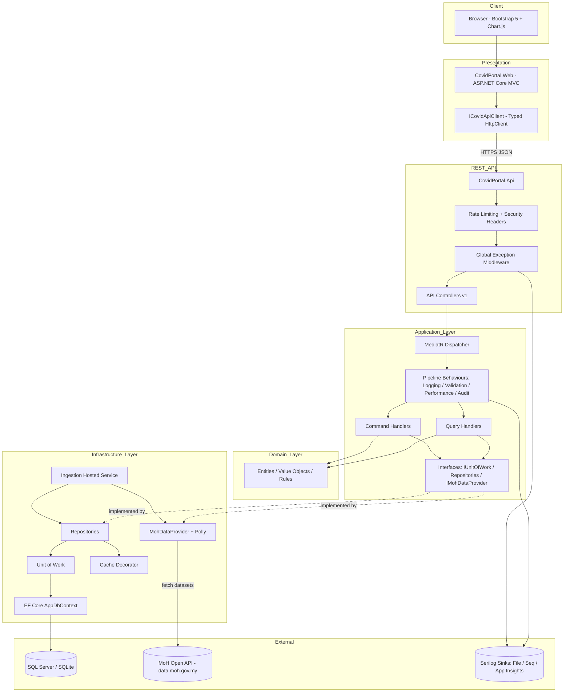
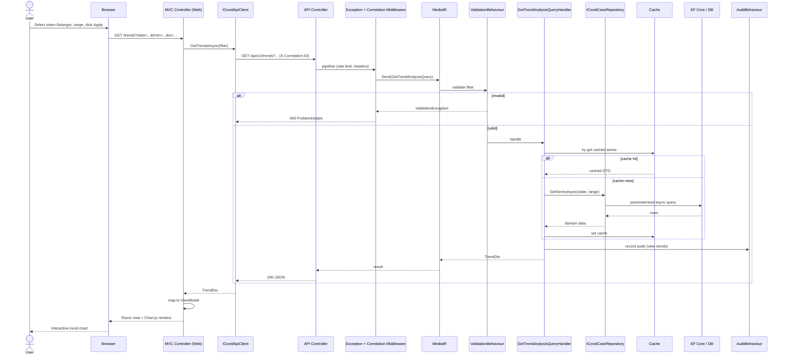
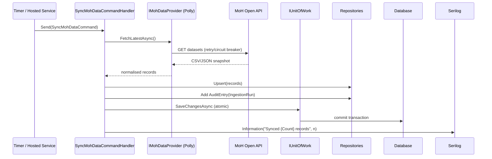

# COVID-19 Analytics Portal — Solution Architecture & Implementation Blueprint

> **Status:** Design / Pre-implementation
> **Stack:** .NET 8 · ASP.NET Core MVC · Clean Architecture · CQRS (selective) · Bootstrap 5
> **Data source:** Ministry of Health Malaysia — `https://data.moh.gov.my` (KKMNOW) via the public Data Catalogue / Open API (`https://api.data.gov.my`) and the open CSV datasets (`github.com/MoH-Malaysia/covid19-public`).

---

## Table of Contents
1. [Solution Architecture](#1-solution-architecture)
2. [Project Structure](#2-project-structure)
3. [Layer Responsibilities](#3-layer-responsibilities)
4. [Dependency Flow](#4-dependency-flow)
5. [Design Patterns Used](#5-design-patterns-used)
6. [Security Design](#6-security-design)
7. [Logging Design](#7-logging-design)
8. [Testing Strategy](#8-testing-strategy)
9. [Mermaid Architecture Diagram](#9-mermaid-architecture-diagram)
10. [Mermaid Request Flow Diagram](#10-mermaid-request-flow-diagram)
11. [Architectural Decision Records (ADR)](#11-architectural-decision-records-adr)
12. [Implementation Roadmap](#12-implementation-roadmap)

---

## 1. Solution Architecture

### 1.1 Overview
The portal is a **server-rendered ASP.NET Core MVC** web application backed by an **internal REST API**. The MVC presentation layer consumes the API over HTTP (via a typed `HttpClient`), demonstrating the required *"REST API consumed by MVC"* pattern while keeping a clean seam for a future SPA or mobile client.

The system follows **Clean Architecture** (a.k.a. Onion / Hexagonal): business rules sit at the centre with **zero outward dependencies**; frameworks, the database, and the external MoH data feed are *plug-in details* on the outer ring.

```
            ┌──────────────────────────────────────────────┐
            │              Presentation (Outer)             │
            │  MVC Web App  ·  Web API  ·  Bootstrap Views  │
            ├──────────────────────────────────────────────┤
            │              Infrastructure (Outer)           │
            │  EF Core · MoH HttpClient · Caching · Serilog │
            ├──────────────────────────────────────────────┤
            │              Application (Inner)              │
            │  CQRS Handlers · DTOs · Interfaces · Mapping  │
            ├──────────────────────────────────────────────┤
            │                Domain (Core)                  │
            │  Entities · Value Objects · Enums · Rules     │
            └──────────────────────────────────────────────┘
```

### 1.2 Architectural Style Summary
| Concern | Decision |
|---|---|
| Macro style | Modular monolith, Clean Architecture |
| Inter-layer comms | In-process; MVC → API over HTTP |
| Read/write separation | CQRS via MediatR (queries dominate; commands for audit/refresh) |
| Data acquisition | Scheduled ingestion `BackgroundService` (implemented) + on-demand sync from MoH Open API |
| Local persistence | EF Core (SQL Server / SQLite for dev) as a read-optimised cache of MoH data |
| UI | Razor Views + Bootstrap 5 + Chart.js |

### 1.3 Why a local persistence layer?
The MoH Open API is rate-limited and the static datasets are daily snapshots. We **ingest and normalise** the data into a local store so the portal can:
- Serve fast, paginated, filterable analytics without hammering the upstream API.
- Compute trends/aggregations server-side.
- Remain available if the upstream feed is temporarily unreachable (resilience).
- Maintain an **immutable audit trail** of ingestion runs and user-facing data access.

---

## 2. Project Structure

```
SeniorDeveloperAssignment/
│
├─ src/
│  ├─ CovidPortal.Domain/                 # Core — no dependencies
│  │  ├─ Entities/
│  │  │  ├─ CovidCaseRecord.cs
│  │  │  ├─ VaccinationRecord.cs
│  │  │  ├─ State.cs
│  │  │  └─ AuditEntry.cs
│  │  ├─ ValueObjects/
│  │  │  ├─ DateRange.cs
│  │  │  └─ Iso3166State.cs
│  │  ├─ Enums/
│  │  │  ├─ MetricType.cs
│  │  │  └─ AuditAction.cs
│  │  ├─ Common/                          # Base classes: Entity, AuditableEntity
│  │  └─ Exceptions/                      # DomainException, NotFoundException
│  │
│  ├─ CovidPortal.Application/            # Use cases — depends on Domain only
│  │  ├─ Common/
│  │  │  ├─ Interfaces/
│  │  │  │  ├─ IUnitOfWork.cs
│  │  │  │  ├─ ICovidCaseRepository.cs
│  │  │  │  ├─ IVaccinationRepository.cs
│  │  │  │  ├─ IAuditRepository.cs
│  │  │  │  ├─ IMohDataProvider.cs        # external feed abstraction
│  │  │  │  └─ IDateTimeProvider.cs
│  │  │  ├─ Behaviours/                   # MediatR pipeline: Logging, Validation, Audit
│  │  │  ├─ Mappings/                     # AutoMapper profiles
│  │  │  └─ Models/                       # PagedResult<T>, Result<T>
│  │  ├─ Dashboard/Queries/GetDashboardSummary/
│  │  ├─ Statistics/Queries/GetStatistics/
│  │  ├─ Trends/Queries/GetTrendAnalysis/
│  │  ├─ History/Queries/GetHistoricalSeries/
│  │  ├─ Filtering/Queries/GetStates/
│  │  ├─ Ingestion/Commands/SyncMohData/  # write side
│  │  └─ Audit/Queries/GetAuditTrail/
│  │
│  ├─ CovidPortal.Infrastructure/         # Implementation details
│  │  ├─ Persistence/
│  │  │  ├─ AppDbContext.cs
│  │  │  ├─ Configurations/               # IEntityTypeConfiguration<T>
│  │  │  ├─ Repositories/                 # concrete repos
│  │  │  ├─ UnitOfWork.cs
│  │  │  └─ Migrations/
│  │  ├─ ExternalServices/Moh/
│  │  │  ├─ MohDataProvider.cs            # typed HttpClient + Polly
│  │  │  ├─ MohApiOptions.cs
│  │  │  └─ Dtos/                         # raw upstream contracts
│  │  ├─ Caching/                         # IMemoryCache / HybridCache wrapper
│  │  ├─ BackgroundJobs/
│  │  │  └─ MohIngestionHostedService.cs  # scheduled sync
│  │  └─ DependencyInjection.cs
│  │
│  ├─ CovidPortal.Api/                    # REST API consumed by MVC
│  │  ├─ Controllers/
│  │  │  ├─ DashboardController.cs
│  │  │  ├─ StatisticsController.cs
│  │  │  ├─ TrendsController.cs
│  │  │  ├─ HistoryController.cs
│  │  │  ├─ StatesController.cs
│  │  │  └─ AuditController.cs
│  │  ├─ Middleware/
│  │  │  └─ GlobalExceptionHandlingMiddleware.cs
│  │  ├─ Filters/
│  │  ├─ Program.cs
│  │  └─ appsettings.json
│  │
│  └─ CovidPortal.Web/                    # MVC presentation
│     ├─ Controllers/                     # thin: call API client, return Views
│     ├─ Views/
│     │  ├─ Dashboard/  Statistics/  Trends/  History/  Audit/
│     │  ├─ Shared/_Layout.cshtml
│     │  └─ _ViewImports.cshtml
│     ├─ Models/ViewModels/
│     ├─ Services/                        # ICovidApiClient (typed HttpClient)
│     ├─ wwwroot/                         # Bootstrap, Chart.js, site.js
│     └─ Program.cs
│
├─ tests/
│  ├─ CovidPortal.Domain.UnitTests/
│  ├─ CovidPortal.Application.UnitTests/
│  ├─ CovidPortal.Infrastructure.IntegrationTests/
│  └─ CovidPortal.Api.FunctionalTests/
│
├─ docs/
│  ├─ ARCHITECTURE.md                     # this document
│  └─ adr/                                # individual ADR markdown files
│
├─ .editorconfig
├─ Directory.Build.props                  # shared analyzers, nullable, langversion
├─ global.json                            # pin .NET 8 SDK
└─ CovidPortal.sln
```

> **Dependency direction is enforced by project references** (and optionally by an architecture test, e.g. NetArchTest). `Domain` references nothing; `Application` references `Domain`; `Infrastructure` & `Api` reference `Application`; `Web` references only the API client contract (HTTP), not Infrastructure.

> **As-built note (delivered).** This tree is the design blueprint; project names ship as `CovidAnalyticsPortal.*`. The migration + ingestion slice is implemented as:
> - `Infrastructure/Persistence/Migrations/` — EF Core `InitialCreate` migration (auto-applied at start-up by `Persistence/DatabaseMigrationExtensions.MigrateDatabaseAsync`), plus `Persistence/AppDbContextFactory.cs` for design-time tooling.
> - `Infrastructure/BackgroundServices/CovidDataSyncBackgroundService.cs` (the scheduled hosted service) and `CovidDataImporter.cs` (the idempotent upsert), configured via `CovidDataSyncOptions`. Ingestion is realised as Infrastructure background work rather than an `Application` `SyncMohData` command.

---

## 3. Layer Responsibilities

### 3.1 Domain (`CovidPortal.Domain`)
- **Owns:** Entities, Value Objects, Enums, domain exceptions, invariants, base `AuditableEntity`.
- **Knows nothing about:** EF Core, HTTP, ASP.NET, MediatR, logging frameworks.
- **Rules examples:** a `DateRange` cannot have `End < Start`; a `CovidCaseRecord` cannot have negative counts; state codes validated against ISO-3166-2:MY.

### 3.2 Application (`CovidPortal.Application`)
- **Owns:** Use cases as CQRS **Queries/Commands + Handlers** (MediatR), DTOs, validation (FluentValidation), AutoMapper profiles, and **interfaces** for all infrastructure concerns (repositories, UoW, MoH provider, clock, cache).
- **Cross-cutting via MediatR pipeline behaviours:** `LoggingBehaviour`, `ValidationBehaviour`, `PerformanceBehaviour`, `AuditBehaviour`.
- **Depends on:** Domain only. Defines abstractions; never references concrete infrastructure.

### 3.3 Infrastructure (`CovidPortal.Infrastructure`)
- **Owns:** EF Core `AppDbContext`, entity configurations, **concrete repositories**, **Unit of Work**, the **MoH typed HttpClient provider** (with Polly resilience), caching, and the **background ingestion hosted service**.
- **Implements** the interfaces declared in Application.
- **Depends on:** Application (for interfaces) + Domain.

### 3.4 API (`CovidPortal.Api`)
- **Owns:** REST endpoints (versioned `/api/v1/...`), the **global exception-handling middleware**, model binding/validation surface, Swagger/OpenAPI, rate limiting, security headers.
- **Responsibility:** Translate HTTP ⇄ MediatR requests; return appropriate status codes + `ProblemDetails`. **No business logic.**

### 3.5 Web / MVC (`CovidPortal.Web`)
- **Owns:** Controllers (thin), Razor Views, ViewModels, Bootstrap UI, Chart.js rendering, and a **typed `ICovidApiClient`** that consumes the REST API.
- **Responsibility:** Presentation + user interaction only. Maps API DTOs → ViewModels. No direct DB or domain access.

| Layer | May reference | Must NOT reference |
|---|---|---|
| Domain | — | Everything else |
| Application | Domain | Infrastructure, Api, Web |
| Infrastructure | Application, Domain | Api, Web |
| Api | Application, Infrastructure (DI wiring) | Web |
| Web | (API over HTTP) | Domain, Infrastructure directly |

---

## 4. Dependency Flow

**Compile-time references point inward** (Dependency Rule). **Runtime control flows outward** through interfaces (Dependency Inversion).


- The **composition root** is `CovidPortal.Api/Program.cs` (and `CovidPortal.Web/Program.cs` for the web client). Concrete types are registered here so inner layers stay dependency-free.
- Application defines `IMohDataProvider`; Infrastructure provides `MohDataProvider`. Application never sees the HTTP detail — this is **Dependency Inversion** in action.

---

## 5. Design Patterns Used

| Pattern | Where | Why |
|---|---|---|
| **Clean / Onion Architecture** | Solution-wide | Testability, separation of concerns, framework independence |
| **CQRS** (selective) | Application handlers | Read-heavy analytics separated from write-side ingestion/audit; clearer intent |
| **Mediator** | MediatR dispatch + pipeline behaviours | Decouples controllers from handlers; central place for cross-cutting concerns |
| **Repository** | `ICovidCaseRepository`, etc. | Abstracts persistence; swappable; testable with fakes |
| **Unit of Work** | `IUnitOfWork` wrapping `DbContext.SaveChanges` | Atomic multi-repository transactions, single commit boundary |
| **Specification** (optional) | Query filtering | Composable, reusable filter predicates for state/date filtering |
| **Options** | `MohApiOptions`, `CacheOptions` | Strongly-typed, validated configuration |
| **Typed HttpClient + Factory** | `IMohDataProvider`, `ICovidApiClient` | Proper socket lifetime, named clients, Polly integration |
| **Circuit Breaker / Retry (Polly)** | MoH provider | Resilience against upstream failures/rate limits |
| **Decorator** | Caching layer over repositories/provider | Add caching without changing core logic |
| **Result / ProblemDetails** | Cross-layer error modelling | Explicit success/failure without exception-driven flow |
| **Factory / Strategy** | Metric aggregation (cases vs. vaccinations vs. deaths) | Extensible metric computation |
| **DTO + Mapper (AutoMapper)** | Boundaries | Prevents leaking entities across layers |
| **Background Hosted Service** | Scheduled ingestion | Decouples data refresh from request path |

---

## 6. Security Design

Aligned with **OWASP Top 10**.

### 6.1 Input & Injection
- **Parameterised queries only** via EF Core (no string concatenation) → mitigates SQL injection (A03).
- **Server-side validation** with FluentValidation on every query/command; reject out-of-range dates, unknown state codes, oversized page sizes.
- **Output encoding** by default in Razor; Chart data passed as JSON via `@Html.Raw(JsonSerializer.Serialize(...))` only after encoding/whitelisting → mitigates XSS.

### 6.2 Transport & Headers
- **HTTPS enforced** (`UseHttpsRedirection`, HSTS).
- Security headers middleware: `Content-Security-Policy`, `X-Content-Type-Options: nosniff`, `X-Frame-Options: DENY`, `Referrer-Policy`, `Permissions-Policy`.
- **Antiforgery tokens** on all state-changing POST forms (manual data-refresh trigger / audit filters).

### 6.3 Access & Abuse Control
- **Rate limiting** (`Microsoft.AspNetCore.RateLimiting`, fixed/sliding window) on API endpoints to protect the upstream MoH feed and the portal.
- **CORS** locked to the MVC web origin only.
- **AuthN/AuthZ ready:** Identity/JWT scaffolding points included; the Audit Trail and manual-sync endpoints are gated behind an `Admin` policy (RBAC). (Public read endpoints can remain anonymous per assignment scope.)

### 6.4 Secrets & Configuration
- No secrets in source. **User Secrets** in dev, **environment variables / Key Vault** in prod.
- MoH API base URL/keys via validated `IOptions<MohApiOptions>`.
- `appsettings.{Environment}.json` layering; production overrides never committed.

### 6.5 Data & Error Hygiene
- **Global exception handler** returns sanitised `ProblemDetails` — **no stack traces or internal details** leak to clients (A05/A09).
- PII is essentially absent (aggregate public data); audit logs store actor, action, timestamp, correlation id — not sensitive payloads.
- **Dependency scanning** via `dotnet list package --vulnerable` in CI; analyzers (`Directory.Build.props`) treat security warnings as errors.

### 6.6 Outbound (SSRF/A10)
- MoH base address is **fixed via configuration allow-list**; the app never fetches arbitrary user-supplied URLs.

---

## 7. Logging Design

### 7.1 Structured Logging with Serilog
- **Serilog** as the provider with sinks: **Console** (dev), **File (rolling, JSON)**, and **Seq/Application Insights** (prod-ready).
- **Structured/semantic logs** — log message templates with properties, never string interpolation:
  ```
  Log.Information("Synced {RecordCount} records for {State} in {ElapsedMs} ms", count, state, ms);
  ```

### 7.2 Correlation & Enrichment
- **Correlation ID** middleware assigns/propagates `X-Correlation-ID` across MVC → API → handlers → MoH calls; enriched onto every log via `LogContext`.
- Enrichers: environment, machine name, request path, user/actor, correlation id.

### 7.3 Pipeline-level Observability (CQRS)
- `LoggingBehaviour` logs every request name + duration.
- `PerformanceBehaviour` warns when a handler exceeds a threshold (e.g. >500 ms).
- HTTP request logging via `UseSerilogRequestLogging` (method, path, status, elapsed).

### 7.4 Log Levels Policy
| Level | Use |
|---|---|
| Trace/Debug | Dev diagnostics, suppressed in prod |
| Information | Successful operations, ingestion summaries, request completion |
| Warning | Recoverable issues: cache miss storms, upstream retries, slow handlers |
| Error | Handled exceptions, failed ingestion, upstream circuit open |
| Critical | Startup failure, data store unavailable |

### 7.5 Audit Trail vs. Logs (distinct concerns)
- **Logs** = operational diagnostics (transient, may roll off).
- **Audit Trail** = a **business feature** persisted in the DB (`AuditEntry`), immutable, queryable in the UI: who viewed/filtered/exported what and when, plus every ingestion run. Written via the `AuditBehaviour` pipeline + `IAuditRepository`.

---

## 8. Testing Strategy

Follows the **test pyramid**: many fast unit tests, fewer integration tests, a thin slice of functional/E2E.

| Level | Project | Scope | Tooling |
|---|---|---|---|
| **Unit — Domain** | `Domain.UnitTests` | Entity invariants, value objects, business rules | xUnit, FluentAssertions |
| **Unit — Application** | `Application.UnitTests` | CQRS handlers, validators, mapping, behaviours (mocked repos/UoW/provider) | xUnit, Moq/NSubstitute, FluentAssertions, AutoFixture |
| **Integration** | `Infrastructure.IntegrationTests` | Repositories + EF Core against **SQLite in-memory/Testcontainers**, UoW transactions, MoH provider against a **WireMock** stub | xUnit, Testcontainers, WireMock.Net, Respawn |
| **Functional / API** | `Api.FunctionalTests` | End-to-end through `WebApplicationFactory`, real pipeline, in-memory DB, exception middleware, validation, status codes | xUnit, `Microsoft.AspNetCore.Mvc.Testing` |
| **Architecture tests** | (in App tests) | Enforce dependency rules (Domain references nothing, etc.) | NetArchTest.Rules |
| **UI smoke (optional)** | — | Critical dashboard renders, filters work | Playwright |

**Quality gates / CI:**
- Coverage target ≥ **80%** on Domain + Application (Coverlet + ReportGenerator).
- `dotnet format` + analyzers must pass.
- `dotnet list package --vulnerable --include-transitive` must be clean.
- All tests green required to merge.

**Principles:** Arrange-Act-Assert, deterministic (injected `IDateTimeProvider`), no network in unit tests, one logical assertion theme per test, descriptive `Method_Scenario_ExpectedResult` naming.

---

## 9. Mermaid Architecture Diagram



---

## 10. Mermaid Request Flow Diagram

### 10.1 Read flow — user views Trend Analysis with state/date filters



### 10.2 Write flow — scheduled ingestion from MoH



---

## 11. Architectural Decision Records (ADR)

> Format: lightweight MADR. Each would live as its own file under `docs/adr/`.

### ADR-001 — Adopt Clean Architecture
- **Status:** Accepted
- **Context:** Senior assignment demands SOLID, separation of concerns, testability, and enterprise structure.
- **Decision:** Use 4-layer Clean Architecture (Domain, Application, Infrastructure, Presentation) with the dependency rule enforced via project references + architecture tests.
- **Consequences:** + High testability, framework independence, clear boundaries. − More projects/boilerplate; mapping overhead.

### ADR-002 — REST API consumed by MVC (split Web + Api)
- **Status:** Accepted
- **Context:** Requirement: *"REST API consumed by MVC."*
- **Decision:** Separate `CovidPortal.Api` (REST) and `CovidPortal.Web` (MVC). Web calls API via a typed `HttpClient`.
- **Consequences:** + Demonstrates API consumption, future-proof for SPA/mobile, clear contract. − Extra network hop and serialization; two hosts to run/deploy (mitigated by aspnet aggregation or running both for the demo).
- **Alternatives:** Single MVC app calling MediatR directly (rejected — does not satisfy the explicit REST-consumption requirement).

### ADR-003 — Selective CQRS with MediatR
- **Status:** Accepted
- **Context:** Analytics is read-dominant; ingestion/audit are writes.
- **Decision:** Use CQRS via MediatR with separate Query/Command handlers and pipeline behaviours; **not** full event-sourcing or separate read/write databases.
- **Consequences:** + Clear intent, centralised cross-cutting concerns, testable handlers. − Indirection; learning curve. *"CQRS if beneficial"* satisfied without over-engineering.

### ADR-004 — Repository + Unit of Work over raw DbContext
- **Status:** Accepted
- **Context:** Requirements explicitly list both patterns.
- **Decision:** Expose `IRepository` abstractions and an `IUnitOfWork` that wraps `SaveChangesAsync`. DbContext stays in Infrastructure.
- **Consequences:** + Testable, persistence-agnostic, single commit boundary. − Some consider it redundant over EF's built-in UoW; justified here by the explicit requirement and the multi-repository ingestion transaction.

### ADR-005 — Local persistence as a read cache of MoH data
- **Status:** Accepted
- **Context:** Upstream MoH Open API is rate-limited; datasets are daily snapshots.
- **Decision:** Ingest/normalise MoH data into EF Core store via a scheduled hosted service; serve analytics locally.
- **Consequences:** + Performance, resilience, server-side aggregation, audit history. − Data freshness bounded by sync cadence; storage + ingestion logic to maintain.

### ADR-006 — Serilog for structured logging
- **Status:** Accepted
- **Decision:** Serilog with correlation enrichment and JSON sinks; `UseSerilogRequestLogging`.
- **Consequences:** + Queryable structured logs, rich ecosystem. − Extra config vs. default `ILogger`. (Still programmed against `ILogger<T>` so the provider stays swappable.)

### ADR-007 — Global exception handling middleware + ProblemDetails
- **Status:** Accepted
- **Decision:** Centralised middleware maps exceptions → RFC 7807 `ProblemDetails`; domain/validation exceptions map to 4xx, unexpected to 500 with sanitised body.
- **Consequences:** + Consistent errors, no leakage, no try/catch sprawl. − Must maintain exception→status mapping.

### ADR-008 — Polly resilience for the MoH HttpClient
- **Status:** Accepted
- **Decision:** Wrap the typed MoH client with retry (jittered backoff), timeout, and circuit breaker via `Microsoft.Extensions.Http.Resilience`.
- **Consequences:** + Robust against transient upstream failures/rate limits. − Tuning required to avoid masking real outages.

### ADR-009 — Bootstrap 5 + Chart.js for UI
- **Status:** Accepted
- **Decision:** Server-rendered Razor + Bootstrap 5 responsive grid; Chart.js for historical/trend charts.
- **Consequences:** + Meets Bootstrap requirement, fast to build, accessible, no heavy SPA toolchain. − Less interactivity than a full SPA (acceptable for scope).

### ADR-010 — SQL Server (prod) with SQLite (dev/test)
- **Status:** Accepted
- **Decision:** EF Core with provider abstraction; SQLite for local/dev/integration tests, SQL Server for production.
- **Consequences:** + Frictionless local dev and CI, parity via EF Core. − Minor provider-specific behavioural differences to watch (covered by integration tests).

---

## 12. Implementation Roadmap

| Phase | Deliverable |
|---|---|
| 0 | Solution scaffold, `Directory.Build.props`, analyzers, `global.json`, solution layout |
| 1 | Domain entities, value objects, enums, base classes, unit tests |
| 2 | Application interfaces, CQRS queries/commands, validators, mappings, behaviours + tests |
| 3 | Infrastructure: EF Core, configs, repositories, UoW, migrations + integration tests |
| 4 | MoH provider (typed client + Polly), ingestion hosted service, caching |
| 5 | REST API: controllers, exception middleware, rate limiting, security headers, Swagger + functional tests |
| 6 | MVC Web: typed API client, controllers, Bootstrap views, Chart.js, filters |
| 7 | Audit Trail feature (pipeline + UI), Serilog wiring, correlation |
| 8 | Hardening: security headers, vuln scan, coverage gate, README + ADRs |

> **Delivery status (as-built).** Phases 0–3 and 5–8 are in place. Phase 3's **EF Core migration + automatic schema creation at start-up** and Phase 4's **MoH ingestion hosted service** are delivered: `MigrateDatabaseAsync` applies the `InitialCreate` migration on boot, and `CovidDataSyncBackgroundService` + `CovidDataImporter` populate the store from the live MoH feed (failures are caught and retried on the next interval). The dashboard therefore renders without any manual database setup.

---

### Appendix A — Core Domain Entities (planned shape)
- `CovidCaseRecord` — Date, StateCode, NewCases, ActiveCases, Recovered, Deaths, CumulativeCases.
- `VaccinationRecord` — Date, StateCode, DailyDose1/2/Booster, CumulativeFull.
- `State` — Code (ISO-3166-2:MY), Name, Population.
- `AuditEntry` — Id, ActorId, Action, EntityType, CorrelationId, Details, TimestampUtc.

### Appendix B — Representative API Surface (v1)
```
GET /api/v1/dashboard/summary
GET /api/v1/statistics?state=&from=&to=&metric=
GET /api/v1/trends?state=&from=&to=&metric=&granularity=
GET /api/v1/history?state=&from=&to=&metric=
GET /api/v1/states
GET /api/v1/audit?from=&to=&action=        (Admin policy)
POST /api/v1/ingestion/sync                 (Admin policy, triggers SyncMohDataCommand)
```
