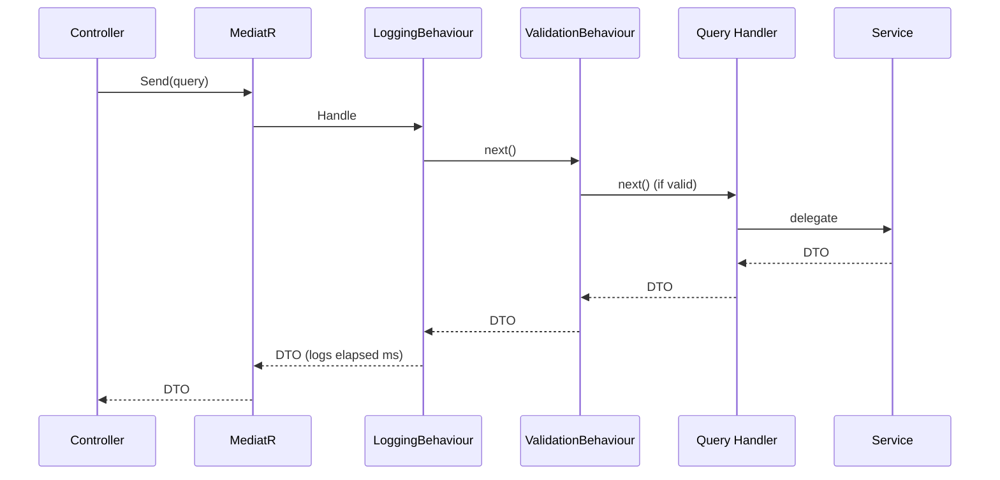
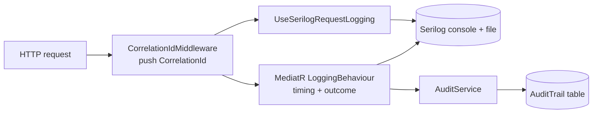

# Architecture & Design

> **Status:** As-built — this document describes the COVID-19 Analytics Portal **as actually implemented**.
> **Stack:** .NET 8 · ASP.NET Core MVC + Web API · Clean Architecture · CQRS (MediatR) · EF Core 8 · Serilog.

This document explains how the solution is structured and why. It is verified against the source code in `src/`. For the rationale behind individual decisions see the [Architecture Decision Records](adr/); for visual models see the [diagrams](diagrams/).

## Table of Contents

1. [Clean Architecture](#1-clean-architecture)
2. [Layer Responsibilities](#2-layer-responsibilities)
3. [Dependency Flow](#3-dependency-flow)
4. [Repository Pattern](#4-repository-pattern)
5. [Unit of Work](#5-unit-of-work)
6. [CQRS Usage](#6-cqrs-usage)
7. [MVC ↔ API Communication](#7-mvc--api-communication)
8. [Security Design](#8-security-design)
9. [Logging Design](#9-logging-design)
10. [Scalability Considerations](#10-scalability-considerations)

---

## 1. Clean Architecture

The portal is organised as concentric layers following **Clean Architecture** (Onion / Hexagonal). Business rules sit at the centre and have **zero dependencies** on frameworks, the database, or the network. Everything volatile — EF Core, ASP.NET, the MoH HTTP feed — lives on the outer rings as replaceable detail.

```
            ┌──────────────────────────────────────────────┐
            │              Presentation (Outer)             │
            │   MVC Web App  ·  REST API  ·  Razor Views    │
            ├──────────────────────────────────────────────┤
            │              Infrastructure (Outer)           │
            │  EF Core · MoH HttpClient · Cache · Serilog   │
            ├──────────────────────────────────────────────┤
            │              Application (Inner)              │
            │  CQRS Handlers · DTOs · Validators · Services │
            ├──────────────────────────────────────────────┤
            │                Domain (Core)                  │
            │   Entities · Value Objects · Enums · Rules    │
            └──────────────────────────────────────────────┘
```

The solution is realised as five projects under `src/`:

| Project | Ring |
|---------|------|
| `CovidAnalyticsPortal.Domain` | Core |
| `CovidAnalyticsPortal.Application` | Inner |
| `CovidAnalyticsPortal.Infrastructure` | Outer |
| `CovidAnalyticsPortal.API` | Outer (presentation/host) |
| `CovidAnalyticsPortal.Web` | Outer (presentation/host) |

The single most important rule is the **dependency rule**: source-code dependencies point only inward. It is enforced structurally by project references — the inner projects simply do not reference the outer ones, so a violation will not compile.

### Why this style

- **Testability** — business logic is exercised without a database or web server (see the unit tests for `DashboardService`/`AnalyticsService`).
- **Framework independence** — EF Core, MediatR, and ASP.NET are details that can be swapped without touching the domain.
- **Explicit boundaries** — each concern has an obvious home, which keeps the codebase navigable as it grows.

See [ADR-001](adr/ADR-001-Clean-Architecture.md).

---

## 2. Layer Responsibilities

### Domain (`CovidAnalyticsPortal.Domain`)

Owns the business model and invariants, and references nothing external.

- **Base types** (`Common/`): `Entity` (identity equality on `Guid Id`), `AuditableEntity` (adds `CreatedAtUtc` / `LastModifiedAtUtc` with `MarkCreated`/`MarkModified`), and `ValueObject` (structural equality via `GetEqualityComponents`).
- **Entities** (`Entities/`): `CovidStatistic` (national daily aggregate), `StateStatistic` (state daily aggregate), `TrendRecord` (a computed trend), and `AuditTrail` (immutable audit event — extends `Entity`, not `AuditableEntity`). Entities use private constructors and static `Create(...)` factories that enforce invariants.
- **Value objects** (`ValueObjects/`): `DateRange` (inclusive, enforces `End >= Start`), `StateCode` (validated against the ISO 3166-2:MY subdivision set, with `Code`/`Name`), and `CaseMetrics` (six non-negative counters with a `Zero` instance).
- **Enums** (`Enums/`): `MetricType` (`Cases`, `ActiveCases`, `Recovered`, `Deaths`), `TrendDirection` (`Stable`, `Increasing`, `Decreasing`), `AuditAction` (`ViewDashboard`, `ViewStatistics`, `ViewTrends`, `ViewHistory`, `ApplyFilter`, `ExportData`, `IngestData`, `SystemError`).
- **Exceptions** (`Exceptions/`): `DomainException`, with a `ThrowIf(condition, message)` guard used by the factories.
- **Abstractions** (`Repositories/`): `IRepository<TEntity>` and `IUnitOfWork` — the persistence contract is declared here, as a domain concept.

**Must not** reference EF Core, ASP.NET, MediatR, or any framework.

### Application (`CovidAnalyticsPortal.Application`)

Orchestrates use cases. References Domain only.

- **CQRS queries + handlers** under `Dashboard/`, `Statistics/`, `Trends/`, `Audit/` (each with `Queries/` and `Dtos/`).
- **Validators** — FluentValidation `AbstractValidator<T>` per query (e.g. `GetStateStatisticsQueryValidator`).
- **Pipeline behaviours** (`Common/Behaviours/`): `LoggingBehaviour`, `ValidationBehaviour`.
- **Service contracts** (`Common/Interfaces/`): `IDashboardService`, `IAnalyticsService`, plus infrastructure-facing abstractions `IMohDataProvider`, `IDateTimeProvider`, `IAuditService`.
- **Service implementations** (`Services/`): `DashboardService`, `AnalyticsService`.
- `DependencyInjection.AddApplication()` registers MediatR, the two behaviours (in order), all validators, and the two scoped services.

**Must not** touch the database or HTTP directly; it depends on abstractions implemented by Infrastructure.

### Infrastructure (`CovidAnalyticsPortal.Infrastructure`)

Implements the abstractions declared by the inner layers. References Application + Domain.

- **Persistence** (`Persistence/`): `AppDbContext` (applies `IEntityTypeConfiguration` from the assembly), the four entity `Configurations/`, the generic `EfRepository<T>`, `UnitOfWork`, EF `Migrations/`, `AppDbContextFactory` (design-time), and `DatabaseMigrationExtensions.MigrateDatabaseAsync`.
- **External services** (`ExternalServices/Moh/`): `MohDataProvider` (a typed `HttpClient` that fetches and normalises MoH CSV datasets and caches them in `IMemoryCache`) and `MohApiOptions`.
- **Background services** (`BackgroundServices/`): `CovidDataSyncBackgroundService` (scheduling) + `CovidDataImporter` (idempotent upsert) + `CovidDataSyncOptions`.
- **Audit** (`Audit/`): `AuditService`.
- **Time** (`Time/`): `SystemDateTimeProvider` (singleton `IDateTimeProvider`).
- **Logging** (`Logging/`): `SerilogConfigurator`.
- `DependencyInjection.AddInfrastructure(config)` wires persistence, the resilient MoH client, memory cache, the clock, the audit service, and data synchronisation.

**Must not** contain business rules.

### API (`CovidAnalyticsPortal.API`)

The REST host. References Application + Infrastructure.

- **Controllers** (`Controllers/V1/`): `DashboardController`, `AnalyticsController`, `AuditController`, all derived from `ApiControllerBase` (which lazily resolves the MediatR `ISender`).
- **Middleware** (`Middleware/`): `CorrelationIdMiddleware`, `SecurityHeadersMiddleware`, `GlobalExceptionHandlingMiddleware`.
- **Cross-cutting**: API versioning (`Asp.Versioning`, URL segment), versioned Swagger (`ConfigureSwaggerOptions`), per-IP rate limiting, request context (`HttpCurrentContext`).
- `Program.cs` composes the pipeline and applies migrations at start-up.

**Must not** contain business logic — controllers translate HTTP into MediatR requests and shape the response.

### Web (`CovidAnalyticsPortal.Web`)

The MVC presentation host. References **none** of the other solution projects.

- **Controllers** (`Controllers/`): `Dashboard`, `Statistics`, `Trends`, `Audit`, `Home` — thin controllers that call the API client and return views.
- **Services** (`Services/`): `ICovidApiClient` / `CovidApiClient` (a typed `HttpClient`) and `CovidApiOptions`.
- **Models** — `ApiContracts/` (HTTP response shapes) and `ViewModels/` (page models).
- **Views** — Razor + Bootstrap 5 + Chart.js.

**Must not** reference Domain/Application/Infrastructure — it consumes the API only over HTTP.

---

## 3. Dependency Flow

```
Web  ──HTTP──▶  API ──▶ Application ──▶ Domain
                         ▲                 ▲
        Infrastructure ──┘─────────────────┘
        (implements Application & Domain interfaces)
```

- `Domain` → (nothing)
- `Application` → `Domain`
- `Infrastructure` → `Application` (+ `Domain`)
- `API` → `Application` + `Infrastructure`
- `Web` → (no solution project; HTTP only)

At runtime the composition root assembles the graph: `Program.cs` calls `AddApplication()`, `AddInfrastructure(configuration)`, and `AddApiServices()`. **Dependency inversion** is the mechanism that lets the flow stay inward while control flows outward: the Application layer declares `IRepository<T>`, `IUnitOfWork`, `IMohDataProvider`, `IDateTimeProvider`, and `IAuditService`; Infrastructure provides the concrete types; the container injects them.

---

## 4. Repository Pattern

The generic repository contract lives in the **Domain** (`Repositories/IRepository.cs`):

```csharp
public interface IRepository<TEntity> where TEntity : Entity
{
    Task<TEntity?> GetByIdAsync(Guid id, CancellationToken ct = default);
    Task<IReadOnlyList<TEntity>> ListAllAsync(CancellationToken ct = default);
    Task<IReadOnlyList<TEntity>> FindAsync(Expression<Func<TEntity, bool>> predicate, CancellationToken ct = default);
    Task<bool> ExistsAsync(Expression<Func<TEntity, bool>> predicate, CancellationToken ct = default);
    Task AddAsync(TEntity entity, CancellationToken ct = default);
    Task AddRangeAsync(IEnumerable<TEntity> entities, CancellationToken ct = default);
    void Update(TEntity entity);
    void Remove(TEntity entity);
}
```

The EF Core implementation (`Infrastructure/Persistence/Repositories/EfRepository.cs`) wraps a `DbSet<TEntity>`:

- **Reads** (`ListAllAsync`, `FindAsync`, `ExistsAsync`) use `AsNoTracking()` because the portal's read paths never mutate the entities they load.
- **Writes** (`AddAsync`, `AddRangeAsync`, `Update`, `Remove`) stage changes only; **they do not call `SaveChanges`** — persistence is committed by the Unit of Work, so multiple changes share one transaction.
- `FindAsync` accepts an `Expression<Func<TEntity, bool>>`, so callers express filters as LINQ predicates that EF translates to parameterised SQL (e.g. `AnalyticsService` filters by date range and optional state).

**Why a repository over raw `DbContext`:** it keeps the persistence contract a first-class domain concept, keeps EF Core out of the inner layers, and makes the services trivially unit-testable with a mocked `IRepository<T>`. See [ADR-002](adr/ADR-002-Repository-Pattern.md).

---

## 5. Unit of Work

`IUnitOfWork` (Domain) groups the four aggregate repositories behind a single commit boundary:

```csharp
public interface IUnitOfWork : IDisposable
{
    IRepository<CovidStatistic> CovidStatistics { get; }
    IRepository<StateStatistic> StateStatistics { get; }
    IRepository<TrendRecord> TrendRecords { get; }
    IRepository<AuditTrail> AuditTrails { get; }
    Task<int> SaveChangesAsync(CancellationToken ct = default);
}
```

The implementation (`Infrastructure/Persistence/UnitOfWork.cs`):

- Owns a single, shared `AppDbContext`. Each repository property is **lazily** created over that same context (`_covidStatistics ??= new EfRepository<CovidStatistic>(_context)`), so every repository participates in the same change tracker and transaction.
- `SaveChangesAsync` commits all staged changes atomically and logs the affected-row count.
- `Dispose` deliberately **does not** dispose the `AppDbContext`: the context is a scoped service owned by the DI container and shared with other scoped consumers within the same request, so disposing it here would cause a double-dispose.

This gives callers a single, intention-revealing commit point. For example, `AuditService` adds an `AuditTrail` and calls `SaveChangesAsync` once; `CovidDataImporter` upserts many statistics and commits them together. See [ADR-003](adr/ADR-003-UnitOfWork.md).

> **Registration note:** the open generic `IRepository<>` → `EfRepository<>` is also registered for any direct consumers, while `IUnitOfWork` → `UnitOfWork` is the primary persistence entry point used by the application services.

---

## 6. CQRS Usage

The portal applies **selective CQRS** with MediatR. Reads dominate, so the implemented requests are all **queries**:

| Query | Handler delegates to | Returns |
|-------|----------------------|---------|
| `GetDashboardQuery` | `IDashboardService.BuildDashboardAsync` | `DashboardDto` |
| `GetStateStatisticsQuery` | `IAnalyticsService.GetStateStatisticsAsync` | `IReadOnlyList<StateStatisticDto>` |
| `GetTrendAnalysisQuery` | `IAnalyticsService.AnalyzeTrendAsync` | `TrendDto` |
| `GetAuditTrailQuery` | repository read | `IReadOnlyList<AuditTrailDto>` |

Handlers are thin: they convert primitive inputs into domain value objects (e.g. `DateRange.Create`, `StateCode.TryParse`) and delegate to a service. Each query has a matching FluentValidation validator.

**Pipeline behaviours** provide cross-cutting concerns once, instead of per-handler. They are registered in `AddApplication()` in this order:

```csharp
services.AddTransient(typeof(IPipelineBehavior<,>), typeof(LoggingBehaviour<,>));
services.AddTransient(typeof(IPipelineBehavior<,>), typeof(ValidationBehaviour<,>));
```

So every request is **logged first** (`LoggingBehaviour` times the handler and records success/failure), **then validated** (`ValidationBehaviour` runs all `IValidator<TRequest>` and throws a `ValidationException` if any fail) before reaching the handler.

The design intentionally stops short of event sourcing or separate read/write databases — that would be over-engineering for a read-centric analytics portal.



---

## 7. MVC ↔ API Communication

The Web app never references the API, Application, or Domain assemblies. It communicates purely over HTTP through a **typed `HttpClient`**:

- `ICovidApiClient` (Web) declares the operations the UI needs: `GetDashboardAsync`, `GetLatestDataDateAsync`, `GetStateStatisticsAsync`, `GetTrendAsync`, and `GetAuditTrailAsync`.
- `CovidApiClient` is registered with `AddHttpClient<ICovidApiClient, CovidApiClient>(...)`, configured from validated `CovidApiOptions` (`BaseUrl`, `TimeoutSeconds`, `ApiVersion`) and requests `application/json`.
- Web controllers (e.g. `DashboardController`) inject `ICovidApiClient`, call it, map the `*Response` API contracts to view models, and render Razor views with Bootstrap + Chart.js.

```
Browser ──▶ Web MVC Controller ──▶ ICovidApiClient (typed HttpClient)
                                        │  HTTP/JSON
                                        ▼
                                  API Controller (v1) ──▶ MediatR ──▶ Service ──▶ Repository/UoW ──▶ DB
```

This satisfies the "REST API consumed by MVC" requirement and leaves a clean contract for a future SPA or mobile client. The API is **versioned** (`/api/v1.0/...`) so the contract can evolve without breaking consumers. See [ADR-005](adr/ADR-005-COVID-Data-Integration.md) for how the API itself is fed.

---

## 8. Security Design

Security is layered across the HTTP pipeline and the application:

- **Input validation** — FluentValidation runs inside `ValidationBehaviour` for every query (coherent date ranges, no future end dates, recognised state codes, supported metrics). Invalid input never reaches a handler.
- **Injection resistance** — all persistence is parameterised EF Core LINQ; there is no dynamic SQL.
- **Security headers** — `SecurityHeadersMiddleware` sets a restrictive `Content-Security-Policy` (`default-src 'none'; frame-ancestors 'none'`), `X-Content-Type-Options: nosniff`, `X-Frame-Options: DENY`, `Referrer-Policy: no-referrer`, `Permissions-Policy`, and strips the `Server` header — applied to every response, including errors.
- **Error hygiene** — `GlobalExceptionHandlingMiddleware` maps `ValidationException` → 400 (`ValidationProblemDetails` with an `errors` dictionary), `DomainException` → 400, and everything else → 500 with the message suppressed outside Development. All responses are RFC 7807 `ProblemDetails` stamped with the correlation ID.
- **SSRF protection** — the MoH base address comes only from validated `MohApiOptions` (`ValidateDataAnnotations` + `ValidateOnStart`); no user input influences outbound URLs.
- **Rate limiting** — a per-IP fixed-window limiter (100 req/min, partitioned by remote IP) returns HTTP 429 on rejection and is applied to all mapped controllers.
- **Transport** — HTTPS redirection on both hosts; HSTS on the Web host outside Development.
- **Auditability** — `AuditService` records an immutable `AuditTrail` (actor, action, correlation ID, timestamp, optional entity/parameters/IP) for data-access and ingestion events. Audit failures are caught and logged so they cannot break the primary request.
- **No PII** — only aggregate public data is processed.

This aligns with the OWASP Top 10 categories most relevant to a public read API (A03 injection, A05 misconfiguration, A09 logging/monitoring, A10 SSRF). See [ADR-004](adr/ADR-004-Logging-and-Observability.md).

---

## 9. Logging Design

Two distinct concerns are kept separate:

**Operational logging (Serilog).**

- Configured in the API via `SerilogFileConfiguration` (and `Infrastructure/Logging/SerilogConfigurator`) with console + rolling-file sinks and environment/thread enrichers. A bootstrap logger captures start-up failures.
- `CorrelationIdMiddleware` resolves/echoes `X-Correlation-ID` and pushes it into the Serilog `LogContext` so **every** log line for a request carries it.
- `UseSerilogRequestLogging()` emits one structured entry per request (method, path, status, elapsed), placed after the exception handler so it records the final status.
- `LoggingBehaviour` adds per-request MediatR timing and success/failure logs.

**Business audit logging (`AuditTrail`).** A persisted, queryable record of meaningful events — independent of operational logs and exposed through the Audit endpoint. This separation means log verbosity/retention policies never affect the integrity of the audit record.



---

## 10. Scalability Considerations

The current design is a modular monolith optimised for a read-heavy public portal. Properties that support scaling, and the levers available:

- **Local read store as a cache.** Ingesting MoH snapshots into a local store decouples request latency from the upstream feed and lets aggregation/trend computation happen server-side. The store is effectively a read model of public snapshots.
- **Stateless API hosts.** The API keeps no per-user session state, so it can scale out horizontally behind a load balancer. The only shared state is the database.
- **Pluggable provider.** Persistence can switch from SQLite (dev) to SQL Server (prod) purely via configuration (`Database:Provider`), and SQL Server registration enables `EnableRetryOnFailure` for transient-fault resilience.
- **Read efficiency.** Repositories use `AsNoTracking()` for reads; queries are filtered in the database via translated predicates rather than in memory.
- **Outbound resilience.** The MoH client uses the standard resilience handler (retry, attempt/total timeouts, circuit breaker) plus `IMemoryCache`, so upstream rate limits or outages degrade gracefully.
- **Caching.** `IMemoryCache` is per-instance; under scale-out it can be promoted to a distributed cache (e.g. Redis) without touching callers.
- **Bounded abuse.** Per-IP rate limiting protects both the portal and the upstream feed.

Known scaling caveats and how to address them:

- **Start-up migration race.** `MigrateDatabaseAsync` runs at start-up for zero-touch setup; for multi-instance deploys this should be moved to a dedicated deploy step (see README §13 and [ADR-005](adr/ADR-005-COVID-Data-Integration.md)).
- **Background ingestion on every instance.** `CovidDataSyncBackgroundService` runs per host; under scale-out it should be gated to a single instance (leader election) or extracted into a dedicated worker.
- **In-memory cache duplication.** Each instance caches independently; a distributed cache removes duplication and cold-start cost.
