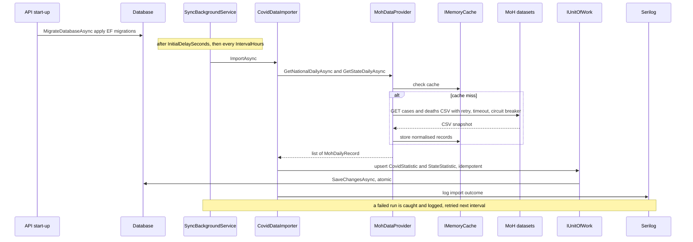
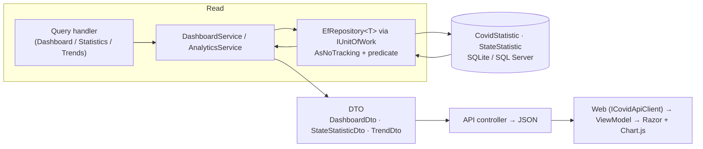

# Data Flow Diagram

How COVID-19 data moves from the upstream Ministry of Health feed into the local store, and how it is read back by the analytics features. This reflects the actual background service, importer, provider, persistence, and read services.

## Ingestion (write path)

## Querying (read path)

## Data shaping

- **Upstream → domain:** `MohDataProvider` normalises raw CSV rows; `CovidDataImporter` maps them into domain value objects — `CaseMetrics` (six non-negative counters), `StateCode` (validated ISO 3166-2:MY), and `DateOnly` — and into `CovidStatistic` / `StateStatistic` aggregates.
- **Domain → DTO:** read services project entities into flat, serialisation-friendly DTOs. `AnalyticsService` additionally builds a `TrendRecord` in the domain to compute change, percentage change, and direction for `TrendDto`.
- **Idempotency:** ingestion upserts by natural key (date, and state for state data), so repeated runs converge rather than duplicate.
- **Freshness:** the local store lags the source by at most `CovidDataSync:IntervalHours` (default 12h).
