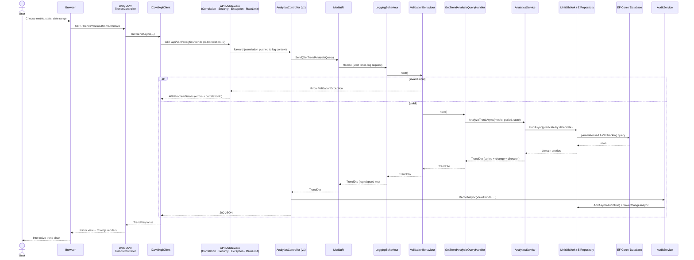

# Request Flow Diagram

A read request — **Trend Analysis with filters** — traced from the browser through the MVC app, the REST API, the MediatR pipeline, and the database. This reflects the actual controllers, behaviours, handler, and service in the solution.

## Notes

- **Behaviour order:** `LoggingBehaviour` wraps `ValidationBehaviour`, which wraps the handler (registration order in `AddApplication()`). Requests are logged first, then validated.
- **Error path:** validation/domain failures surface as RFC 7807 `ProblemDetails` with the correlation ID; unexpected errors become a sanitised 500.
- **Audit:** the Dashboard and Analytics controllers record an `AuditTrail` entry after a successful query; audit failures are swallowed and logged so they never affect the response.
