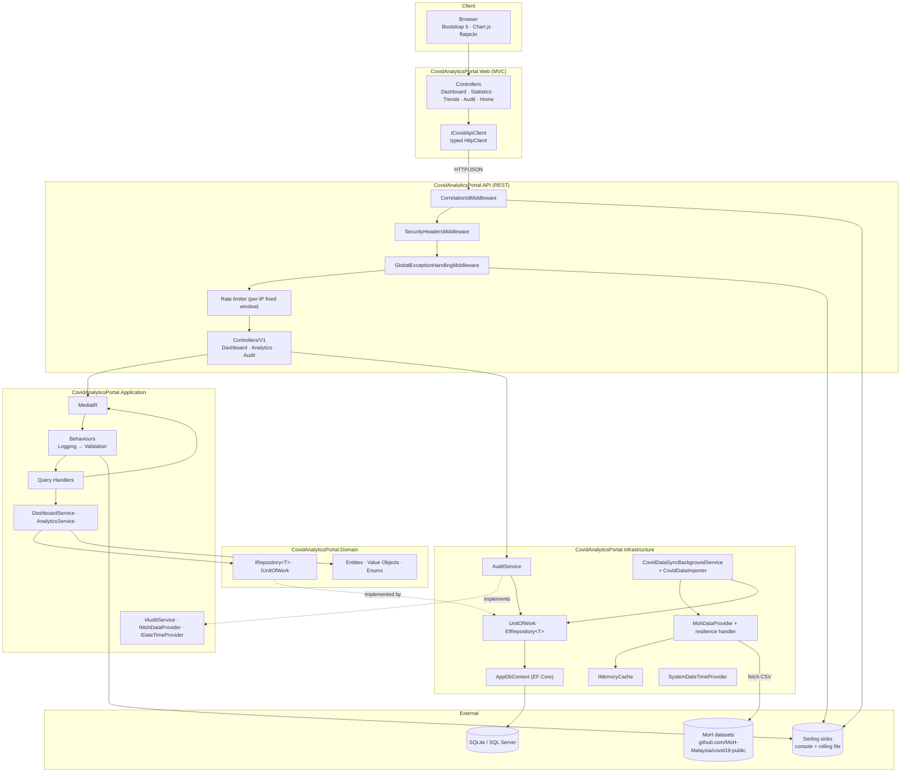

# Solution Architecture Diagram

The portal is a two-host modular monolith built with Clean Architecture. The MVC Web app consumes the REST API over HTTP; the API hosts the Application/Infrastructure layers around the Domain core. This diagram reflects the actual projects, services, and middleware in `src/`.

## Notes

- **Dependency rule:** Web references no other solution project; it talks to the API only over HTTP. Domain references nothing; Application references Domain; Infrastructure + API reference Application.
- **Composition root:** `API/Program.cs` calls `AddApplication()`, `AddInfrastructure(configuration)`, and `AddApiServices()`, then applies migrations via `MigrateDatabaseAsync` before serving requests.
- **Pipeline order:** correlation → security headers → request logging → exception handling → HTTPS redirect → rate limiter → controllers.
